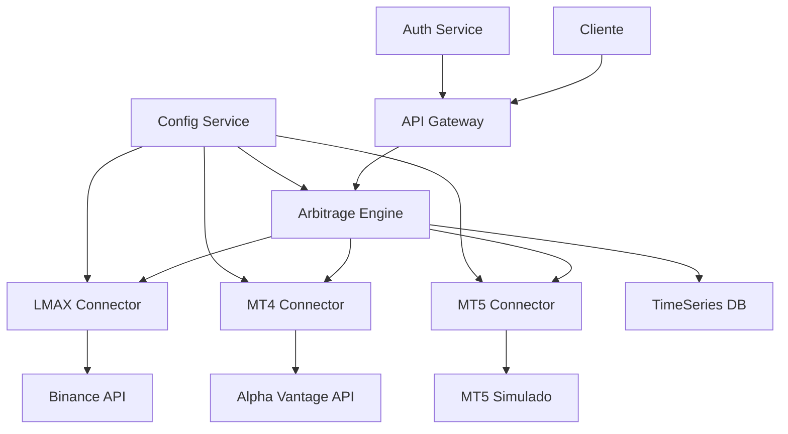

# Informe de Análisis: Sistema de Arbitraje de Criptomonedas

## Resumen del Proyecto

El proyecto es un sistema de arbitraje de criptomonedas que utiliza múltiples conectores para obtener precios en tiempo real de diferentes exchanges y ejecutar operaciones de arbitraje cuando se detectan oportunidades rentables. El sistema está compuesto por varios microservicios dockerizados, incluyendo un motor de arbitraje, conectores para diferentes fuentes de datos (LMAX/Binance, MT4/Alpha Vantage, y MT5 simulado), y servicios de apoyo como autenticación y configuración.

## Arquitectura del Sistema



## Análisis de Componentes

### 1. API Gateway
- **Estado**: Funcional
- **Observaciones**: Se inicia correctamente y está escuchando en el puerto 8000.

### 2. Arbitrage Engine
- **Estado**: Funcional
- **Observaciones**: Se inicia correctamente y está escuchando en el puerto 8000.

### 3. LMAX Connector (Binance)
- **Estado**: Error
- **Observaciones**: Falla al iniciar debido a una dependencia faltante: `ModuleNotFoundError: No module named 'binance'`

### 4. MT4 Connector (Alpha Vantage)
- **Estado**: Error
- **Observaciones**: Falla al iniciar debido a una dependencia faltante: `ModuleNotFoundError: No module named 'aiohttp'`

### 5. MT5 Connector
- **Estado**: Funcional
- **Observaciones**: Se inicia correctamente y está escuchando en el puerto 8000.

### 6. TimeSeries DB
- **Estado**: Funcional con advertencias
- **Observaciones**: Se inicia, pero muestra advertencias sobre la falta de configuración inicial.

### 7. Config Service
- **Estado**: Funcional
- **Observaciones**: Se inicia correctamente y está escuchando en el puerto 8000.

### 8. Auth Service
- **Estado**: Funcional
- **Observaciones**: Se inicia correctamente y está escuchando en el puerto 8000.

## Problemas Identificados y Recomendaciones

1. **Dependencias faltantes en LMAX y MT4 Connectors**
   - **Problema**: Los contenedores de LMAX y MT4 fallan al iniciar debido a módulos faltantes.
   - **Recomendación**: Actualizar los archivos `requirements.txt` de estos servicios para incluir las dependencias faltantes:
     ```
     # Para LMAX Connector
     python-binance
     
     # Para MT4 Connector
     aiohttp
     ```
   - **Acción**: Añada estas líneas a los respectivos `requirements.txt` y reconstruya los contenedores.

2. **Advertencias en TimeSeries DB**
   - **Problema**: El contenedor de TimeSeries DB muestra advertencias sobre la falta de configuración inicial.
   - **Recomendación**: Configurar las variables de entorno necesarias para la inicialización de InfluxDB.
   - **Acción**: Añada las siguientes variables de entorno al servicio `timeseries_db` en el `docker-compose.yml`:
     ```yaml
     environment:
       - DOCKER_INFLUXDB_INIT_MODE=setup
       - DOCKER_INFLUXDB_INIT_USERNAME=myusername
       - DOCKER_INFLUXDB_INIT_PASSWORD=mypassword
       - DOCKER_INFLUXDB_INIT_ORG=myorg
       - DOCKER_INFLUXDB_INIT_BUCKET=mybucket
     ```

3. **Puertos duplicados**
   - **Problema**: Varios servicios están configurados para usar el puerto 8000, lo que podría causar conflictos.
   - **Recomendación**: Asignar puertos únicos a cada servicio.
   - **Acción**: Modifique el `docker-compose.yml` para asignar puertos diferentes a cada servicio, por ejemplo:
     ```yaml
     api_gateway:
       ports:
         - "8000:8000"
     arbitrage_engine:
       ports:
         - "8001:8000"
     lmax_connector:
       ports:
         - "8002:8000"
     # ... y así sucesivamente para los demás servicios
     ```

4. **Seguridad de las API Keys**
   - **Problema**: Las API keys están hardcodeadas en los archivos `.py` o en variables de entorno en el `docker-compose.yml`.
   - **Recomendación**: Utilizar un servicio de gestión de secretos o, como mínimo, usar un archivo `.env` para todas las keys y secretos.
   - **Acción**: Cree un archivo `.env` en la raíz del proyecto y referencie estas variables en el `docker-compose.yml`:
     ```
     BINANCE_API_KEY=your_binance_api_key
     BINANCE_SECRET_KEY=your_binance_secret_key
     ALPHA_VANTAGE_API_KEY=your_alpha_vantage_api_key
     API_KEY=your_internal_api_key
     ```

5. **Manejo de errores en el Arbitrage Engine**
   - **Problema**: El código actual no maneja adecuadamente los escenarios donde uno o más conectores fallan.
   - **Recomendación**: Implementar un manejo de errores más robusto en el Arbitrage Engine.
   - **Acción**: Modifique la función `check_arbitrage` en el Arbitrage Engine para manejar casos donde las respuestas de los conectores son None o incompletas.

## Pasos para Corregir

1. Actualice los archivos `requirements.txt` de LMAX y MT4 Connectors.
2. Modifique el `docker-compose.yml` para incluir las variables de entorno de InfluxDB y asignar puertos únicos.
3. Cree un archivo `.env` en la raíz del proyecto con todas las API keys y secretos.
4. Reconstruya y reinicie todos los contenedores:
   ```
   docker-compose down
   docker-compose build
   docker-compose up
   ```

5. Revise los logs después de reiniciar para asegurarse de que todos los servicios se inician correctamente.

## Conclusión

El sistema de arbitraje de criptomonedas tiene una arquitectura sólida y bien pensada. Con las correcciones sugeridas, debería funcionar como se espera. Es importante realizar pruebas exhaustivas después de implementar estos cambios para asegurar que el sistema funcione correctamente en diferentes escenarios de mercado. 